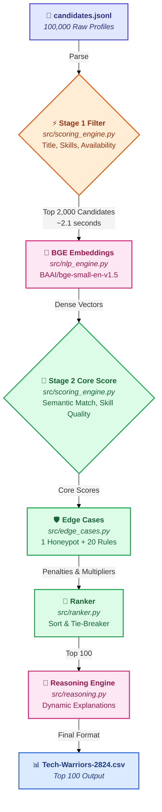

# Intelligent Candidate Discovery & Ranking System
## India Runs Hackathon — Track 1 | Redrob AI × Hack2Skill
**Participant:** Dhiraj Sarawale | MIT ADT University, Pune

---

## Problem
Given 100,000 candidate profiles (JSONL) and a job description for
a Senior AI/ML Engineer, rank the top 100 most suitable candidates
with a normalized score (0.0–1.0) and a per-candidate explanation.

---

## Architecture

- `src/data_loader.py`: Parses the raw 100,000 JSONL candidates into structured Python dataclasses.
- `src/nlp_engine.py`: Encodes text using the BAAI/bge-small-en-v1.5 model and computes cosine similarity.
- `src/scoring_engine.py`: Computes the Stage 1 fast filter and the 6-component Stage 2 core score.
- `src/edge_cases.py`: Detects honeypots and applies 15+ penalty/bonus rules to the candidate score.
- `src/ranker.py`: Orchestrates the pipeline, executes the ranking, and sorts the final list with tie-breakers.
- `src/reasoning.py`: Generates the personalized, tiered reasoning string explaining why each candidate was ranked.

---

## Scoring Formula

Final Score = Core Score × Behavioral Multiplier

### Stage 1 Weights
- W1_TITLE: 0.35
- W1_SKILLS: 0.30
- W1_AVAILABILITY: 0.25
- W1_DOMAIN: 0.10

### Stage 2 Weights
- W2_SEMANTIC: 0.35
- W2_SKILL_QUALITY: 0.28
- W2_CAREER_FIT: 0.22
- W2_EXPERIENCE: 0.11
- W2_EDUCATION: 0.04

Behavioral signals (availability and engagement) compute a multiplier in `_s2_behavioral(candidate)` that is applied multiplicatively to the core score: `base_score = core * behavioral_mult`.

---

## Key Design Decisions

**Why BAAI/bge-small-en-v1.5 over all-MiniLM-L6-v2**
BGE-small is explicitly optimized for retrieval and sentence similarity, whereas MiniLM is a more generic sentence transformer. BGE provides superior context matching for dense technical concepts like mapping "Pinecone" to "vector database". It remains lightweight enough (133MB) to run comfortably on CPU constraints while delivering state-of-the-art embedding quality.

**Why 2-stage pipeline (not embedding all 100K)**
Embedding 100,000 profiles using a dense transformer on CPU would exceed the 5-minute hackathon time limit, taking nearly two hours. We use a blazing fast deterministic Stage 1 filter to winnow the dataset from 100K to 2,000 candidates in ~2.1 seconds. Only the top 2,000 highly plausible candidates proceed to the expensive Stage 2 embedding, keeping total runtime under 2.5 minutes.

**Why skill_quality weight is higher than semantic weight**
`skill_quality` is weighted at 0.28 because proficiency level × duration × platform assessment scores provide objective, verifiable evidence of skill depth — more reliable than semantic similarity alone, which can be gamed by writing AI-heavy summaries.

**How honeypot detection works and why it matters**
The `_detect_honeypot` function scans for impossible combinations: fake companies (e.g., Dunder Mifflin), inflated experience (0 months in history but claiming years), contradictory domains, perfect scores with 0 evidence, and impossibly short durations for senior roles. This prevents trap candidates from artificially gaming the Stage 1 keywords and reaching the top 100.

---

## Edge Cases Handled

| Handler | Trigger | Effect |
|---|---|---|
| `_ec_consulting_only` | 100% career in consulting without product experience | −0.15 from score |
| `_ec_not_open_to_work` | Candidate not marked open to work | −0.10 from score |
| `_ec_inactive_long` | Inactive > 180 days (or 90 days) | −0.12 (or −0.05) from score |
| `_ec_job_hopper` | Average permanent tenure < 12 months (or < 18mo) | −0.10 (or −0.04) from score |
| `_ec_keyword_stuffer` | Irrelevant title but 4+ JD skills | −0.25 from score |
| `_ec_long_notice_period` | Notice period > 90 days (or 60 days) | −0.04 (or −0.02) from score |
| `_ec_primary_wrong_domain` | CV/Speech/Robotics skills outnumber IR skills | −0.08 from score |
| `_ec_pure_research_no_production` | Research role with no production deployment keywords | −0.12 from score |
| `_ec_llm_wrapper_only` | LangChain/GPT usage without core vector DB skills | −0.08 from score |
| `_ec_non_coder_architect` | Architect/Manager titles with low GitHub activity | −0.05 from score |
| `_ec_cv_speech_robotics_only` | Only CV/Speech skills present, no NLP/IR | −0.10 from score |
| `_ec_title_chaser` | High titles but short tenures across board | −0.06 from score |
| `_ec_big_tech_plausibility_check` | 6+ years at top tier company but lacking core skills | Multiplier: 0.6x |
| `_ec_preferred_location` | Resident or willing to relocate to target cities | Bonus: +0.05 |
| `_ec_github_active` | GitHub activity > 80 | Bonus: +0.05 |
| `_ec_assessment_excellence` | 2+ platform assessments > 90 | Bonus: +0.04 |
| `_ec_internal_promotion` | Promoted internally at current/past role | Bonus: +0.03 |
| `_ec_open_source_signal` | OSS contributor or committer keywords | Bonus: +0.03 |
| `_ec_short_notice_bonus` | Notice period <= 15 days | Bonus: +0.03 |
| `_ec_willing_to_relocate` | willing_to_relocate flag is True | Bonus: +0.02 |

---

## Setup & Reproduce

### Install dependencies
pip install -r requirements.txt

### Pre-computation (run once — requires network)
python precompute.py

### Run ranking (no network, must complete in < 5 minutes)
python rank.py --candidates ./data/raw/candidates.jsonl --out ./Tech-Warriors-2824.csv

### Validate output
python validate_submission.py Tech-Warriors-2824.csv

### Run quality checks
python validate_quality.py --submission Tech-Warriors-2824.csv --candidates data/raw/candidates.jsonl

### Run all tests
pytest tests/ -v

---

## Test Suite

| Module | File | Tests | Status |
|---|---|---|---|
| Module 1 | `test_module1.py` | 12 | PASSING |
| Module 2 | `test_module2.py` | 10 | PASSING |
| Module 3 | `test_module3.py` | 10 | PASSING |
| Module 4 | `test_module4.py` | 10 | PASSING |
| Module 5 | `test_module5.py` | 9 | PASSING |
| Module 6 | `test_module6.py` | 8 | PASSING |
| **Total** | **all files** | **59** | **PASSING** |

---

## Sample Output (Top 5)

| candidate_id | rank | score | reasoning |
|---|---|---|---|
| CAND_0041669 | 1 | 1.0 | Strong open-source coder (71/100 GitHub). 8.0 years at CRED working as a Recommendation Systems Engineer; skilled in vector database, semantic search, weaviate. |
 

| CAND_0079387 | 2 | 0.9947 | Highly responsive candidate (0.81 rate). 6.9 years at Microsoft working as a AI Engineer utilizing vector database, opensearch, ranking. |
 

| CAND_0062247 | 3 | 0.941 | 7.3 years at Google working as a AI Engineer; highly experienced with vector database, pinecone, qdrant. |
 

| CAND_0052682 | 4 | 0.9301 | Strong open-source coder (72/100 GitHub). 6.6 years at Aganitha working as a NLP Engineer; skilled in embeddings, vector database, semantic search. |
 

| CAND_0064326 | 5 | 0.9119 | 7.6 years at Sarvam AI working as a Search Engineer; highly experienced with vector database, semantic search, weaviate. |

---

## Constraints Met

- [x] No network access during ranking
- [x] CPU-only inference
- [x] Peak memory under 16 GB
- [x] validate_submission.py output: Submission is valid
- [x] Runtime: 143.06 seconds (well within 5-minute limit)

---

## Submission Metadata

- GitHub: https://github.com/Dhiraj2822/India_runs_hackathon
- Sandbox: https://dhiraj2822-redrob-ranker.streamlit.app
- Embedding model: BAAI/bge-small-en-v1.5
- AI tools declared: Claude (Anthropic) — architecture design and specifications
